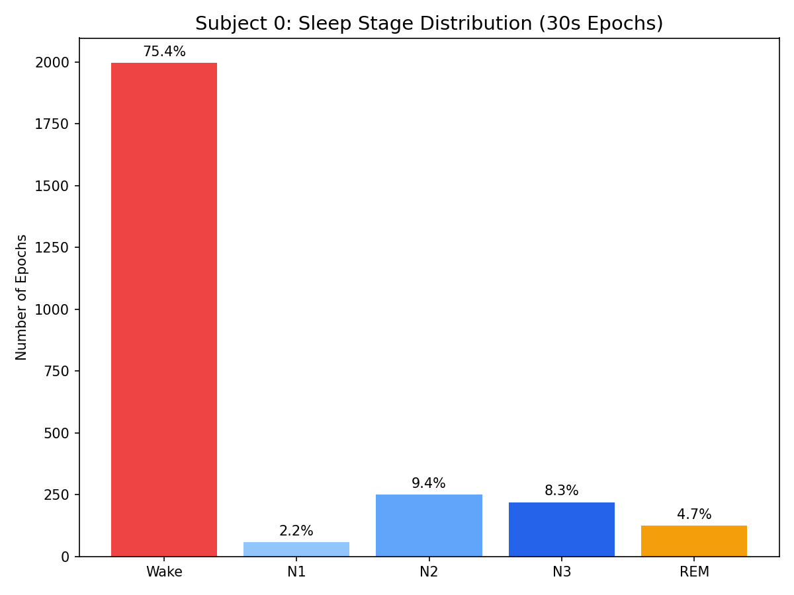
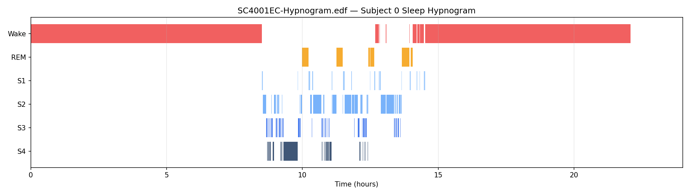
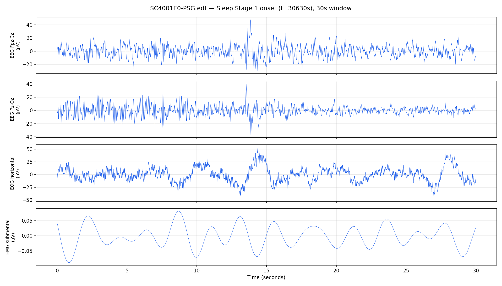
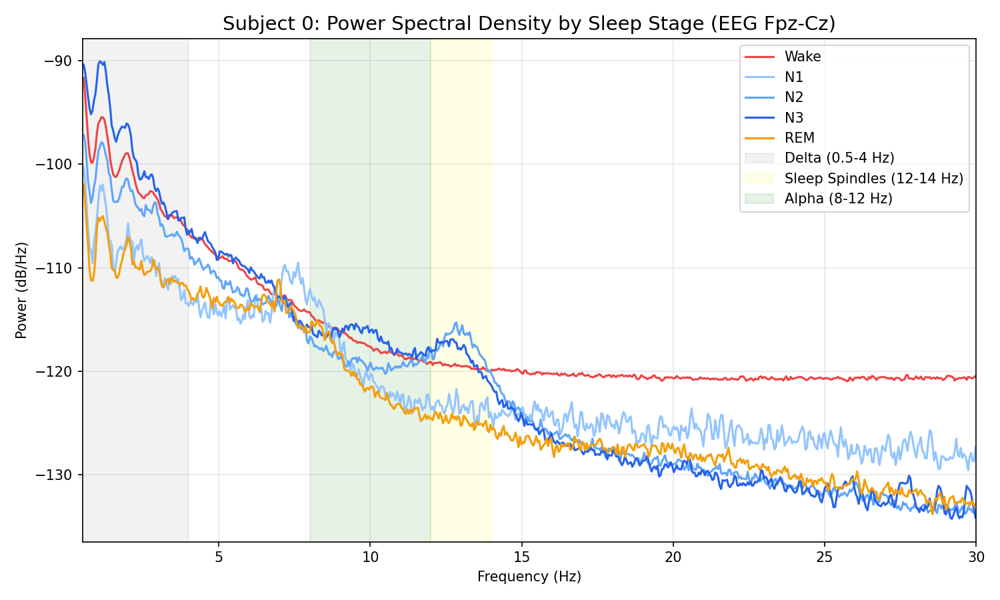
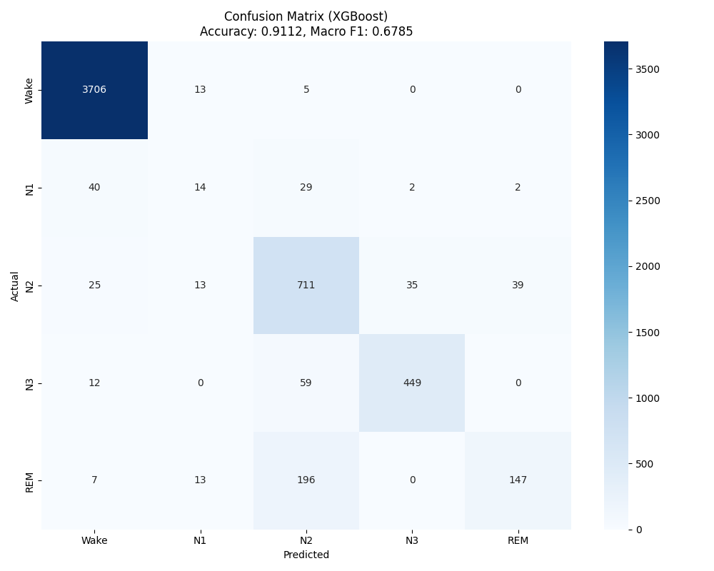

# 0. Context

This project is conducted in the context of a healthcare analytics organization focused on developing scalable, data-driven tools to support sleep research and clinical diagnostics. The organization’s broader goal is to reduce reliance on manual processes in sleep studies and improve the efficiency of large-scale sleep monitoring systems. In particular, the team is interested in exploring whether simplified sensing pipelines, such as EEG-only setups, can provide sufficiently reliable performance to support internal workflows or assist clinical decision-making.

The primary stakeholder for this analysis is a senior data science lead responsible for evaluating the feasibility of deploying automated sleep staging models within the organization. Their role involves making decisions about whether to invest further in model development, what level of model complexity is justified, and whether a reduced-signal system can replace or complement existing polysomnography-based pipelines. This includes balancing model performance against practical considerations such as cost, scalability, interpretability, and robustness.

From a decision-making perspective, the key question is not only whether a model achieves high accuracy, but whether its performance is sufficiently reliable across subjects and across sleep stages—especially clinically important but difficult stages such as N1—to justify further internal deployment or integration into existing workflows. As a result, this project is framed not purely as a modeling exercise, but as an evaluation of whether EEG-based automated sleep staging meets the practical requirements for real-world use within the organization.

# 1. Introduction

Sleep staging is a fundamental component of sleep research and clinical diagnostics, traditionally performed through manual annotation of polysomnography (PSG) recordings by trained experts. However, this process is time-consuming, costly, and difficult to scale, which limits its practicality for large-scale studies and real-world deployment. As a result, there is growing interest in developing automated methods that can reliably classify sleep stages using physiological signals.

In this project, we investigate whether electroencephalography (EEG) signals alone are sufficient for accurate sleep stage classification. This question is particularly relevant from a decision-making perspective. If EEG-only models can achieve reliable performance, they could reduce reliance on full PSG setups and support more efficient and scalable sleep monitoring solutions. If performance remains limited, this would suggest that additional modalities or more complex systems are necessary.

Our analysis focuses on two main questions. First, we assess whether EEG contains enough information to support meaningful classification across standard sleep stages. Second, we evaluate whether more advanced models, including attention-based architectures and U-Net-inspired deep learning models, provide practically meaningful improvements over a simpler baseline model, XGBoost. This comparison is important because increased model complexity should be justified not only by statistical improvement but also by practical value in real-world applications.

Following the progress update, two additional motivations became important in shaping the later stages of the project. First, because the dataset contains only a small number of subjects, relying on a single train/test split may not provide a sufficiently reliable assessment of subject-level generalization. This motivated us to further examine model behavior under cross-validation. Second, because sleep stages evolve sequentially over time, predicting each epoch independently may ignore important transition structure between stages. This motivated us to explore HMM-based decoding with the Viterbi algorithm on top of the deep model outputs in order to incorporate sleep stage transitions into the final prediction sequence.

Ultimately, the goal of this study is to provide clear, evidence-based guidance on whether EEG-based automated sleep staging is sufficiently reliable to support further internal development, and which modeling approach offers the best balance between accuracy, complexity, and interpretability.

# 2. Data Source

The analysis is based on the Sleep-EDF Expanded dataset, accessed through the MNE-Python framework. This dataset contains overnight polysomnography recordings together with expert-annotated sleep stage labels, making it well suited for supervised learning in sleep staging.

For this study, we focus exclusively on two EEG channels, Fpz–Cz and Pz–Oz. These channels capture activity from different regions of the brain and provide complementary information about sleep-related brain dynamics. The signals are sampled at 100 Hz, which is sufficient to preserve relevant temporal structure while keeping the data manageable for modeling. By restricting the analysis to EEG signals only, we are able to directly evaluate whether a reduced sensing setup can still support accurate classification.

The dataset includes recordings from 10 subjects, labeled SC400 to SC409, totaling more than 200 hours of sleep data and over 25,000 labeled 30-second epochs. Each epoch is assigned one of five standard sleep stages: Wake, N1, N2, N3, and REM. These labels are derived from expert annotations and serve as the ground truth for model training and evaluation.

To prepare the data for modeling, the continuous EEG recordings are segmented into 30-second epochs and aligned with the annotated sleep stages. Each epoch is then paired with its corresponding label, forming a supervised learning dataset. Importantly, we construct subject-level splits for training, validation, and testing in order to prevent data leakage across individuals and ensure that model performance reflects generalization to unseen subjects.

A key challenge in this dataset is class imbalance. Certain stages, especially Wake and N2, are much more common, while others, most notably N1, are relatively rare. This has important implications for both training and evaluation and motivates the use of macro F1-score in addition to overall accuracy.

# 3. Data Exploration and Exploratory Data Analysis

We conduct exploratory data analysis on the Sleep-EDF dataset to understand the distribution of sleep stages, the temporal structure of sleep, and the spectral characteristics of the EEG signals. The data are segmented into 30-second epochs and labeled into five classes: Wake, N1, N2, N3, and REM. As part of preprocessing, sleep stages 3 and 4 are merged into N3, and ambiguous labels are removed. This ensures consistency with modern sleep staging standards and produces a clean dataset for downstream analysis.

The class distribution reveals a substantial imbalance across sleep stages. Wake dominates the dataset, accounting for approximately 75.4 percent of all epochs, while N1 is severely underrepresented at only 2.2 percent. N2 and N3 contribute 9.4 percent and 8.3 percent respectively, and REM accounts for 4.7 percent. This imbalance suggests that a model trained without correction could be biased toward predicting the Wake stage, achieving high accuracy while performing poorly on minority classes. As a result, the modeling phase must incorporate strategies such as class-weighted losses or sample weighting, together with macro-averaged evaluation metrics, in order to ensure balanced predictive performance across stages (see Figure 1 in Appendix).

The hypnogram provides insight into the temporal structure of sleep across the recording. The subject’s sleep follows a cyclical pattern, transitioning from Wake to lighter stages such as N1 and N2, then into deep sleep N3, and periodically entering REM sleep. Deep sleep occurs primarily in the earlier part of the night, while REM episodes appear more frequently later, which is consistent with known sleep physiology. Frequent transitions between adjacent stages, particularly between N1 and N2, highlight the difficulty of distinguishing these classes. This temporal dependency suggests that sleep staging is inherently a sequence modeling problem, where contextual information from neighboring epochs may improve classification accuracy (see Figure 2 in Appendix).

Inspection of the raw EEG signals further highlights the complexity of the data. The EEG waveforms exhibit clear nonstationary behavior, with both amplitude and frequency varying over time. The two EEG channels, Fpz–Cz and Pz–Oz, show similar overall patterns but also contain subtle differences that may provide complementary information for classification. These observations suggest that the signals contain rich temporal information that can be leveraged by both traditional feature-based methods and deep learning models operating directly on raw data (see Figure 3 in Appendix).

Frequency-domain analysis using power spectral density reveals distinct patterns across sleep stages. Deep sleep N3 shows the highest power in the low-frequency delta band from 0.5 to 4 Hz, reflecting slow-wave activity. N2 exhibits increased power in the sleep spindle range around 12 to 14 Hz, which is a key physiological marker for this stage. Wake demonstrates relatively higher power in mid-frequency bands, while REM generally shows lower overall power and resembles lighter sleep stages. These spectral differences confirm that frequency-based features are informative for sleep stage classification and justify the use of band power features in the baseline modeling approach (see Figure 4 in Appendix).

Overall, the exploratory analysis shows that the dataset contains strong and meaningful structure but also presents several challenges. Severe class imbalance, complex temporal dependence, and overlap between certain stages, especially N1 and N2, make the classification task nontrivial. At the same time, the distinct spectral signatures and observable sleep cycles indicate that accurate classification is achievable with appropriate modeling choices. These findings motivate a modeling strategy that combines feature engineering with sequence-aware approaches while carefully addressing class imbalance in both training and evaluation.

# 4. Data Engineering

The data engineering pipeline is designed to convert raw overnight polysomnography recordings into structured, model-ready inputs. The dataset consists of paired PSG files containing physiological signals and hypnogram files containing expert sleep-stage annotations. For each subject, these two sources are first aligned so that the EEG signals can be accurately matched with their corresponding sleep stage labels. This pairing step is critical because it ensures that each segment of signal is associated with the correct ground-truth annotation.

After alignment, the continuous EEG recordings are segmented into fixed-length 30-second epochs following standard sleep staging conventions. Each epoch is then assigned a single label based on the hypnogram annotation within that time window. During this process, only valid sleep stages are retained, and labels are standardized into five classes: Wake, N1, N2, N3, and REM. In particular, sleep stages 3 and 4 are merged into N3 to match modern clinical definitions, while ambiguous or undefined labels are removed. This step ensures both label consistency and data quality across subjects.

The analysis focuses on two EEG channels, Fpz–Cz and Pz–Oz, which capture brain activity from different regions of the scalp. These channels are selected because they provide complementary information about sleep-related brain dynamics, including transitions from wakefulness to sleep and the emergence of characteristic rhythms during deeper stages. The signals are sampled at 100 Hz, providing sufficient temporal resolution to capture relevant EEG patterns while keeping computational costs manageable.

Following preprocessing, the data are organized into subject-level tensors suitable for machine learning. The input data consist of segmented EEG epochs, and the target labels correspond to the sleep stage of each epoch. This structured representation allows both traditional machine learning models and deep learning architectures to be applied in a consistent framework. In addition, the pipeline is designed to support subject-level splits for training, validation, and testing, which prevents leakage across individuals and provides a realistic evaluation setting.

Overall, the data engineering process transforms raw, high-dimensional physiological recordings into a clean and standardized dataset that preserves both temporal structure and physiological meaning. This pipeline ensures data quality and consistency while directly supporting the modeling objectives of the study.

# 5. Modeling

## 5.1 XGBoost Baseline Model

We use XGBoost as the baseline model for sleep stage classification, providing a strong and interpretable benchmark against which more complex models can be evaluated. The goal is to assess whether advanced, context-aware architectures meaningfully outperform a simpler feature-based approach, making XGBoost a natural starting point for comparison.

Unlike the deep learning models, which operate directly on raw signals, the XGBoost model relies on hand-engineered features extracted from each 30-second EEG epoch. These features are designed to capture both temporal and spectral characteristics of the signal. Specifically, the feature set includes time-domain statistics such as mean, standard deviation, skewness, kurtosis, and zero-crossing rate, together with Hjorth parameters including activity, mobility, and complexity. It also includes frequency-domain features computed using Welch’s method. The spectral features are aggregated over standard EEG bands such as delta, theta, alpha, sigma, beta, and gamma, which are known to correspond to different physiological sleep stages. This design aligns closely with the patterns observed in the exploratory analysis, where distinct frequency signatures were identified across stages.

The model is implemented as a multiclass XGBoost classifier with five output classes corresponding to Wake, N1, N2, N3, and REM. The training configuration uses the multiclass probability objective and is optimized using multiclass log-loss as the evaluation metric. The hyperparameter configuration uses moderate tree depth together with subsampling strategies to balance model complexity and generalization. Early stopping is applied using a validation set so that the model can determine an appropriate number of boosting rounds and reduce overfitting.

To ensure a realistic evaluation, the training pipeline adopts a subject-level data split, so that data from the same individual never appear in both training and testing sets. This prevents leakage caused by highly correlated EEG patterns within a subject. Within the training data, cross-validation is used to tune model parameters and determine the appropriate number of estimators. Class imbalance is addressed through sample weighting, giving more importance to underrepresented stages such as N1 and REM.

Overall, XGBoost serves as a robust and interpretable baseline. It establishes a clear reference point for evaluating whether additional model complexity yields meaningful improvement in sleep stage classification.

## 5.2 Deep Models

We consider two deep learning approaches in this project: an Attention-based model and a U-Sleep-inspired model. Both are designed to operate directly on EEG signals and to capture temporal structure that may not be fully represented by hand-engineered features.

The Attention-based model is intended to improve classification by allowing the model to focus on informative temporal patterns within the EEG sequence. This is particularly relevant for sleep staging because stage boundaries are often ambiguous and neighboring epochs provide useful context. The model therefore aims to capture dependencies across time rather than treating each epoch as entirely independent.

The U-Sleep-inspired model is a deeper architecture motivated by U-Net-style designs for sequence data. It is intended to learn hierarchical temporal features from the EEG and to provide a stronger end-to-end alternative to both the feature-based baseline and the lighter Attention model. Because this architecture is more complex and computationally demanding, it also provides a useful test of whether the added modeling complexity is justified by improved empirical performance.

To preserve reproducibility for the original baseline experiments, the main branch of the project was kept stable for the fixed train/validation/test split trials on both the Attention and U-Sleep models. Later experimentation involving reduced cross-validation and HMM decoding was separated into a dedicated branch so that methodological extensions could be developed without changing the original baseline pipeline.

## 5.3 HMM-Based Decoding

Because sleep staging is inherently sequential, we also extend the modeling framework by adding HMM-based decoding on top of the deep model outputs. In this setting, the neural network first produces per-epoch class probabilities, and the final sleep-stage sequence is then decoded using the Viterbi algorithm together with a transition matrix estimated from the training labels.

The purpose of this extension is to incorporate the fact that sleep stages do not evolve arbitrarily over time. Instead, some transitions are much more plausible than others, and sequence-aware decoding may therefore improve the consistency and realism of the final predictions. The transition weight controls how strongly the decoding process emphasizes transition structure relative to the local class probabilities produced by the neural network.

This sequence-aware component was primarily explored under reduced subject-level cross-validation, where the need for realistic generalization assessment and transition modeling became more important after the progress update.

## 5.4 Experimental Setup and Reproducibility

To support reproducibility while enabling iterative experimentation, we structured the project using separate GitHub branches for different stages of the analysis. The main branch was kept stable and reproducible, containing the original fixed train/validation/test split experiments for both the Attention-based and U-Sleep-inspired models. This branch represents the baseline pipeline used to generate the primary comparison results reported in the earlier stage of the project.

Following feedback from the progress update, we introduced additional branches to support stricter evaluation and sequence-aware modeling. In particular, a dedicated branch named `attention_cv` was created to implement reduced subject-level cross-validation and transition-weight sweeps for the Attention-based model. This branch includes the HMM-based decoding pipeline, where model outputs are combined with a learned transition matrix and decoded using the Viterbi algorithm to incorporate sleep stage dynamics.

Similarly, a separate branch named `u_sleep_cv` was used to run reduced cross-validation experiments for the U-Sleep-inspired model under constrained computational settings. Because these experiments were more computationally intensive and less stable under limited resources, they were isolated from the main branch to avoid affecting the reproducible baseline results.

This branch-based structure allowed us to maintain a clean and reproducible baseline pipeline while continuing to explore more advanced modeling strategies, including subject-level cross-validation and sequence-aware decoding, without introducing inconsistencies into the original experimental setup.

# 6. Results

## 6.1 XGBoost Baseline Results

Under the subject-level evaluation setting, the XGBoost baseline achieved an accuracy of 0.9112 and a macro F1 of 0.6785. These results indicate that the feature-based approach remains a strong benchmark and performs competitively at the aggregate level, particularly given its relative simplicity and interpretability.

The class-level results show that XGBoost performs particularly well on the dominant and more stable sleep stages. Wake is classified almost perfectly, with precision of 0.98, recall of 1.00, and F1-score of 0.99. N3 also shows strong performance, with precision of 0.92, recall of 0.86, and F1-score of 0.89. N2 performs reasonably well, with precision of 0.71, recall of 0.86, and F1-score of 0.78. These results suggest that the hand-engineered EEG features are effective at capturing broad sleep-stage structure, especially for stages with clearer spectral characteristics.

At the same time, the XGBoost results highlight the limitations of the baseline approach on more difficult stages. N1 remains the weakest class, with precision of 0.26, recall of 0.16, and F1-score of 0.20, confirming that the model struggles to identify this short, transitional, and severely underrepresented stage. REM is more successfully detected than N1, but performance remains uneven, with precision of 0.78, recall of 0.40, and F1-score of 0.53. This indicates that while the model is relatively precise when predicting REM, a substantial portion of REM epochs are still missed.

The confusion matrix provides further insight into these errors. Most Wake epochs are correctly classified, with only a negligible number misclassified into other stages. N2 is generally predicted well, although there is noticeable confusion with REM and N3. N3 remains relatively stable, with most errors occurring as confusion with N2, which is consistent with their shared slow-wave characteristics. The most significant errors occur for N1 and REM. N1 is frequently misclassified as Wake and N2, reflecting its transitional nature and overlap with neighboring stages. REM is often confused with N2, indicating that the feature-based representation does not fully separate these patterns under the current setup (see Figure 5 in Appendix).

Overall, the XGBoost results confirm that feature-based EEG classification provides a strong and credible baseline. The model captures the dominant sleep-stage structure effectively and achieves high overall accuracy, but its performance remains uneven across classes, particularly for the minority and transitional stage N1. This reinforces the motivation for exploring more context-aware deep learning and sequence-based approaches.

## 6.2 Fixed Train/Test Split Results for Deep Models

We first evaluated the Attention-based model and the U-Sleep-inspired model under a fixed train/validation/test subject split to determine whether EEG-only deep models could learn meaningful multi-class sleep staging behavior. Under this setting, both models performed well overall, and the U-Sleep-inspired model achieved slightly stronger aggregate performance. Specifically, U-Sleep reached an accuracy of 0.8902 and a macro F1 of 0.7261, while the Attention-based model achieved an accuracy of 0.8714 and a macro F1 of 0.7174. These results suggest that U-Sleep is the stronger model on the fixed-split benchmark when performance is summarized by overall accuracy and macro F1.

At the same time, the comparison is not entirely one-sided once attention is given to the minority class N1. Although U-Sleep achieved a slightly higher N1 F1 score, the Attention model achieved higher N1 recall. This indicates that the Attention model was more sensitive to detecting N1 epochs, even if it also produced more false positives, whereas U-Sleep was somewhat more balanced overall. This distinction matters because N1 is both short in duration and clinically difficult to classify, so overall metrics alone do not fully capture the trade-offs between the two architectures.

The fixed-split results also show that the deep models learned meaningful multi-class behavior rather than collapsing to the majority Wake class. In particular, the confusion matrix for the Attention model shows substantial predictions across Wake, N1, N2, N3, and REM, with especially strong performance on N3 and REM. These findings provide an important baseline before moving to stricter subject-level evaluation.

## 6.3 Reduced Subject-Level Cross-Validation and HMM Results for Attention

Two important issues emerged after the progress update. First, because the dataset contains only 10 subjects, relying solely on a single train/test split is not sufficient for assessing subject-level generalization. Second, sleep staging is inherently sequential, and it is therefore important to consider whether transition-aware decoding can improve performance beyond per-epoch prediction. These concerns motivated the next stage of the experiments: reduced subject-level cross-validation together with HMM-style decoding using the Viterbi algorithm.

To support this workflow while preserving reproducibility, we created a separate branch for running reduced cross-validation experiments and transition-weight sweeps on the Attention model, while keeping the main branch stable for the original fixed-split experiments. Under this updated pipeline, subjects were divided into a development set and a held-out test set. Cross-validation was then performed within the development subjects, after which the selected configuration was retrained and evaluated on the held-out test subjects. Because of runtime restrictions, these experiments were run under a reduced compute budget, so the results should be interpreted primarily as a stricter generalization check rather than as a fully exhaustive benchmark.

Even under this constrained setting, the reduced-cross-validation Attention baseline with transition weight 0.0 achieved a held-out test accuracy of 0.8461 and a macro F1 of 0.5994. This is lower than the fixed-split result, as expected under a more difficult and more realistic subject-level evaluation setting. The decline reinforces the importance of distinguishing between development performance and generalization to unseen individuals in a small-subject dataset.

When HMM-based decoding was added to the Attention model outputs, the results suggest that a moderate transition prior works best. Compared with the baseline at transition weight 0.0, both 0.5 and 1.0 improved overall held-out performance, while 2.0 reduced macro F1. Specifically, transition weight 0.5 achieved an accuracy of 0.8600 and the highest macro F1 of 0.6069. Transition weight 1.0 achieved the highest accuracy at 0.8646, with a macro F1 of 0.6064. Transition weight 2.0 reduced macro F1 to 0.5828 despite maintaining a relatively high accuracy of 0.8541. Because macro F1 is the more appropriate headline metric under severe class imbalance, these results suggest that 0.5 provides the best overall balance among the completed Attention runs, while 2.0 appears to over-constrain the decoding process.

However, the N1 results reveal an important trade-off. Under the reduced-cross-validation baseline with transition weight 0.0, held-out test N1 recall was 48 out of 170, or 0.282. Under transition weight 0.5, N1 recall dropped to 27 out of 170, or 0.159. Under transition weight 1.0, it declined further to 26 out of 170, or 0.153, and under transition weight 2.0, it fell to 22 out of 170, or 0.129. This pattern is consistent with the interpretation that stronger transition priors smooth the sequence in a way that suppresses short-lived N1 predictions. In other words, HMM decoding improves global sequence consistency and modestly improves overall aggregate performance up to a point, but it also reduces sensitivity to the most difficult minority stage. This trade-off is one of the central findings of the project.

## 6.4 Reduced Subject-Level Cross-Validation and HMM Results for U-Sleep

We also ran reduced subject-level cross-validation experiments for the U-Sleep-inspired model using transition weights 0.0 and 0.5. Under this heavily constrained setting, U-Sleep showed unstable performance and much lower overall metrics than in the fixed-split setting, suggesting that the reduced compute budget was insufficient for a reliable comparison on the heavier architecture.

At transition weight 0.0, the held-out test accuracy was 0.2836 and macro F1 was 0.1606. At transition weight 0.5, accuracy improved to 0.4570 and macro F1 improved to 0.1922. However, N1 recall deteriorated sharply after HMM decoding. At 0.0, N1 recall was 0.79, while at 0.5 it dropped to 0.00 for the HMM-decoded output. This is broadly consistent with the Attention findings that sequence-aware decoding can improve aggregate sequence-level performance while suppressing short, difficult minority stages under constrained settings.

Because these U-Sleep cross-validation experiments were conducted under a smoke-style reduced budget and showed considerable instability, they should not be interpreted as a definitive comparison against the Attention model. Rather, they indicate that the heavier architecture likely requires a less constrained training budget before reliable conclusions can be drawn.

# 7. Future Steps

Several important next steps follow naturally from the current findings. The first priority is to extend the stricter subject-level evaluation to the U-Sleep-inspired model under a more appropriate compute budget. In this project, we first carried out the reduced subject-level cross-validation and HMM decoding experiments on the Attention model because of deadline and runtime constraints, while keeping the main branch reproducible for the original fixed-split experiments. Since U-Sleep showed slightly stronger overall fixed-split performance, the next step is to test whether the same transition-aware decoding strategy also improves performance on the stronger model under a stricter evaluation protocol.

Second, HMM decoding should be explored more systematically on more capable hardware. The completed Attention experiments suggest that a moderate transition prior is most effective. Among the tested settings, transition weight 0.5 achieved the best held-out macro F1, while weight 1.0 achieved the highest accuracy and weight 2.0 appeared to over-smooth the predicted sequence. This suggests that sequence-aware decoding is promising, but that its benefit depends strongly on how much transition structure is imposed. Future work should therefore repeat these experiments under a less constrained compute budget and verify whether the same ranking of transition weights holds under more complete subject-level evaluation.

Third, future work should pay closer attention to the minority stage N1. Across the reduced-cross-validation Attention experiments, N1 recall remained low and decreased as the transition prior became stronger. This suggests that while HMM decoding can improve overall sequence-level consistency, it may also smooth away short and difficult transitional stages. Future improvements should therefore explicitly target this trade-off, for example by tuning the transition weight more carefully in the low range, adjusting class weighting or loss design for N1, or using decoding strategies that are less aggressive toward brief state changes.

Fourth, the Laplace smoothing factor used to estimate the HMM transition matrix should also be treated as a tunable hyperparameter rather than being fixed in advance. Because the transition matrix is estimated from a small number of subjects, smoothing may meaningfully affect how strongly rare or unseen stage transitions are penalized. A more systematic study of this factor could make the decoder more robust in low-data settings.

Finally, the most important longer-term improvement is to increase the amount of subject data. With only 10 participants, both the fixed-split and reduced-cross-validation results remain sensitive to how subjects are partitioned, and subject-level generalization is difficult to estimate reliably. Collecting data from more participants would make cross-validation more stable, improve transition estimation for HMM decoding, and strengthen the overall conclusions about whether EEG-only sleep staging can generalize to unseen individuals.

# 8. Conclusion and Lessons Learned

Overall, our experiments show that EEG-only sleep staging is promising, but the answer depends strongly on how the problem is evaluated and what trade-offs are prioritized. At a broad level, the project shows that useful information for sleep staging is present in EEG alone, but also that the task remains difficult because of class imbalance, temporal dependence, and the especially challenging nature of transitional stages such as N1.

The XGBoost baseline provides an important reference point because it shows that hand-engineered time-domain and frequency-domain EEG features can already capture broad sleep-stage structure. Its overall performance is strong, with accuracy of 0.9112 and macro F1 of 0.6785, and it performs especially well on Wake, N2, and N3. At the same time, the baseline also highlights the central limitation of feature-based classification in this setting: performance remains uneven across classes, and N1 is still very difficult to detect. This justifies the move to context-aware deep models not simply as an increase in complexity, but as an attempt to better capture temporal context and stage transitions.

Under the original fixed single train/test split, both deep models performed well, and U-Sleep emerged as the stronger overall model, while the Attention model remained competitive and showed higher sensitivity to N1. This teaches an important lesson: the model with the best overall accuracy or macro F1 is not necessarily the best on the most difficult minority stage. Aggregate metrics alone do not fully describe behavior that may matter clinically.

A second major lesson came from moving to cross-validation after the progress-update feedback. Because the dataset contains only 10 subjects, the fixed-split setting was never sufficient on its own to say much about subject-level generalization. Once we moved to cross-validation, performance dropped substantially compared with the earlier single-split results. This reinforces an important methodological lesson: single-split results are useful for development and initial comparison, but they can overstate how stable performance will be on unseen individuals. The cross-validation experiments were therefore valuable not because they produced the highest scores, but because they provided a more realistic picture of how fragile generalization becomes in a small-subject setting.

The HMM decoding experiments added a third key insight. Modeling sleep stages as a sequence rather than as independent epoch labels did improve overall performance, but only when the transition prior was not too strong. A moderate transition weight gave the best balance, while a stronger transition prior over-smoothed the sequence and reduced macro F1. At the same time, stronger transition priors consistently reduced N1 recall, showing that improving global sequence consistency can come at the cost of suppressing short and difficult transitional states. This is one of the most important findings of the project.

The reduced-compute U-Sleep cross-validation experiments added another practical lesson about working under resource constraints. In the heavily constrained smoke-style setup, U-Sleep became unstable and its results were much weaker than in the fixed-split setting. Even though a moderate transition weight still improved its reduced-compute results somewhat, the experiments were not stable enough to support strong conclusions. This suggests that a heavier model is not always the best vehicle for rapid validation when compute is limited, and under a tight deadline it was reasonable to use the Attention model first for cross-validation and HMM exploration while keeping the baseline pipeline reproducible on the main branch.

More broadly, this project also shows how to approach a modeling problem under real resource constraints. Rather than attempting an infeasible full sweep of every model and every transition setting, we used a staged strategy: starting with an interpretable baseline, establishing behavior under a reproducible fixed split, and then using cross-validation and HMM experiments to test the specific concerns raised by feedback, even if only on a lighter and more tractable architecture first. This allowed us to continue learning under limited time and compute while remaining honest about what the reduced experiments could and could not support.

Overall, the study suggests that EEG-only automated sleep staging is viable enough to justify further development, but not yet strong enough to be treated as a solved problem. The strongest overall fixed-split performance came from U-Sleep, the clearest cross-validation and HMM insights came from the Attention model, and the sequence-decoding experiments showed that moderate transition modeling can help while also exposing a meaningful trade-off with N1 sensitivity. The main takeaway is therefore not simply that deeper or more sequence-aware models are better, but that model architecture, validation design, transition modeling, and compute budget all materially shape the conclusions one can draw about sleep staging performance.

\newpage

# Appendix

## Response to Feedback

The feedback from the Progress Update directly shaped the second half of our project and led to several substantive changes in both the evaluation design and the modeling strategy. In the Progress Update, our framing already emphasized the decision context of whether EEG-only signals could support automated sleep staging and whether additional model complexity was justified, with subject-level splitting proposed as the validation plan. After receiving feedback, we strengthened this decision-oriented framing in the executive report by making the central question more explicit: not only whether EEG contains enough information for useful classification, but also whether the resulting performance is reliable enough to justify further internal development. At the same time, we acknowledge that we did not fully resolve the comment about a concrete deployment threshold. We clarified the practical motivation, but we still do not define a formal performance cutoff that would make EEG-only staging “deployment-ready,” because that threshold would ultimately depend on the intended use case, tolerance for error, and whether the system is meant to assist experts or replace a more complete PSG workflow.

The most important technical feedback concerned subject-level generalization. In the Progress Update, we proposed subject-level train/validation/test splits to avoid leakage, but the feedback correctly pointed out that, with only 10 subjects, a single split is not enough to support strong conclusions about inter-subject generalization. We addressed this by adding a reduced subject-level cross-validation workflow, using development subjects for cross-validation and a held-out test set for final evaluation. This was a direct response to the suggestion that repeated subject holdout experiments would provide a more realistic picture of generalization. In the executive report, this led to one of the main conclusions of the project: performance under stricter subject-level evaluation drops materially relative to the original fixed split, which shows that the earlier results were useful for development but optimistic as estimates of true generalization. We did not complete a full 10-fold leave-one-subject-out study for every model, and the main reason was computational cost. Training the deeper models repeatedly under GitHub Actions runtime limits was not feasible before submission, so we prioritized a reduced but still more rigorous generalization check over leaving the original split unchallenged.

Another major piece of feedback asked whether the fact that sleep stages are consecutive and constrained in how they evolve could be incorporated more directly into the modeling strategy. We addressed this explicitly by adding HMM-based decoding with the Viterbi algorithm on top of the deep model outputs. This was one of the clearest examples where feedback changed the project itself rather than only the write-up. Instead of treating each epoch prediction as fully independent, we estimated a transition matrix from the training labels and used sequence-aware decoding to impose plausible stage transitions. This directly addresses the earlier concern that the model assumptions should better reflect temporal dependence rather than relying only on per-epoch classification. The resulting experiments showed that a moderate transition prior improved aggregate performance, but also reduced N1 recall, especially when the transition weight became too strong. That trade-off became one of the central findings in the final report: sequence consistency can improve while short, difficult transitional stages are suppressed.

We also addressed the feedback about connecting the models more clearly to EEG signal structure. In the Progress Update, the models were described mainly in terms of architecture and purpose, including XGBoost as a baseline, an attention-based model for temporal context, and a U-Sleep-inspired model for multi-scale sequence structure. In the executive report, we made these connections more explicit by tying the XGBoost feature design to the spectral patterns observed in the exploratory analysis, especially delta activity in N3 and spindle-related information in N2, and by explaining the deep models as attempts to learn temporal context and multi-scale EEG structure directly from the signal. However, one point we did not fully address is uncertainty quantification. The feedback raised calibration and reliability as important considerations, and while we improved the rigor of the evaluation using macro F1, confusion matrices, and stricter subject-level validation, we did not complete a formal calibration analysis or confidence-reliability study. This remains future work.

Overall, the feedback led us to improve the project in three main ways: we made the decision context more explicit, we moved beyond a single subject split toward stricter subject-level evaluation, and we incorporated sleep-stage transition structure directly into the modeling framework through HMM decoding. What we did not fully complete was a full leave-one-subject-out evaluation for all models, a formal deployment threshold, and uncertainty quantification, largely because of the combination of limited subject count, limited time, and limited compute. Even so, the feedback substantially improved the rigor of the project and helped shift the final report from a promising modeling exercise toward a more honest and decision-relevant evaluation of EEG-only sleep staging.

## Visualizations

